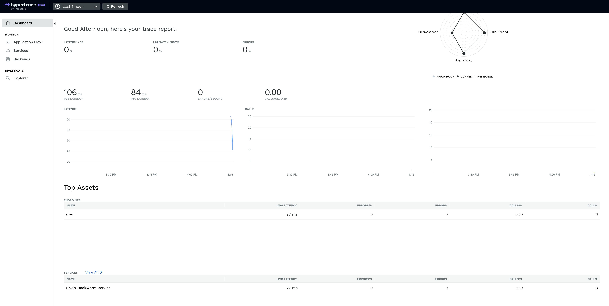
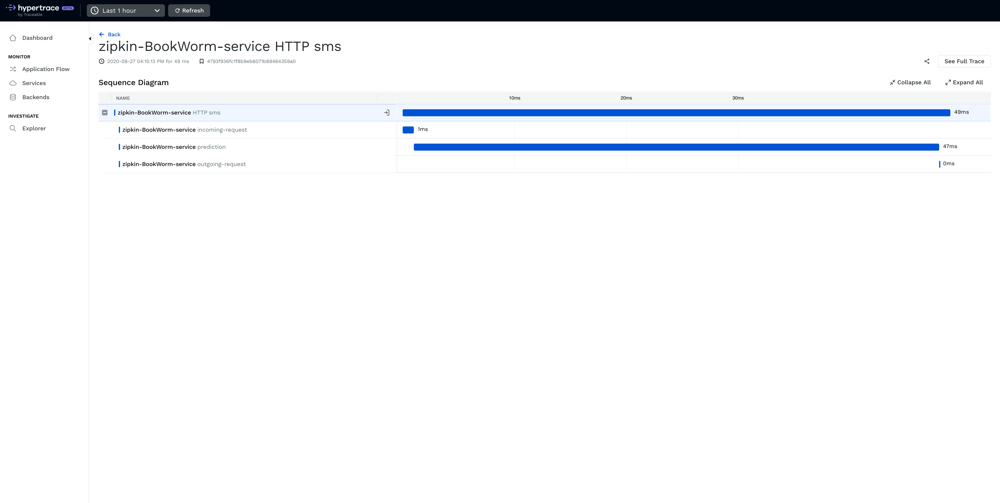

# BookWorm
In this detailed tutorial we will see how we can build a bot which will give us some book recommendations and tell us information about a book we want. We will use OpenTelemetry with Zipkin exporter to trace our requests!

Let's just jump into this!


### Aim:
We will be building the WhatsApp bot which will give us more information about the book whose name we will be providing as an input and will also recommend us similar books!

### What we will need?
-   A Twilio account ---[  sign up for a free one here](https://www.twilio.com/try-twilio)

-   A Twilio whatsapp sandbox ---[  configure one here](https://www.twilio.com/console/sms/whatsapp/sandbox)


-   [Set up your Python and Flask developer environment](https://www.twilio.com/docs/usage/tutorials/how-to-set-up-your-python-and-flask-development-environment) --- Make sure you have Python 3.

-   [ngrok](https://ngrok.com/) so we can [expose our local endpoints so that we can receive incoming webhooks](https://www.twilio.com/blog/2015/09/6-awesome-reasons-to-use-ngrok-when-testing-webhooks.html)

### Dataset:

We will be using [goodbooks-10k](https://github.com/zygmuntz/goodbooks-10k) dataset.

This dataset contains six million ratings for ten thousand most popular (with most ratings) books. There are also:

- books marked to read by the users
- book metadata (author, year, etc.)
- tags/shelves/genres

You can download zipped data from here: https://github.com/zygmuntz/goodbooks-10k/releases

```python 
FLASK_APP=app:app FLASK_ENV=development flask run
```
To test this we'll need to open up a tunnel to our server running on our machine. We will be using ngrok for this. Run this once you have installed ngrok:
```
ngrok http 5000
```
This will open a tunnel pointing to port 5000 and will provide us a  public ngrok URL which will point to our local application. Now, we have to open the WhatsApp Sandbox in our Twilio console and enter that URL plus the path `/sms` into the field labelled `When a message comes in`.


Let's send our sandbox number a message with book name and let's see results:
- Book Information


- Book Recommendation 


- Hypertrace UI


- Trace




 
### What's next?
This was an basic intro to how you can create an sample app and instrument to send traces to Hypertrace! You can explore more about Hypertrace [here](https://docs.hypertrace.org)!
